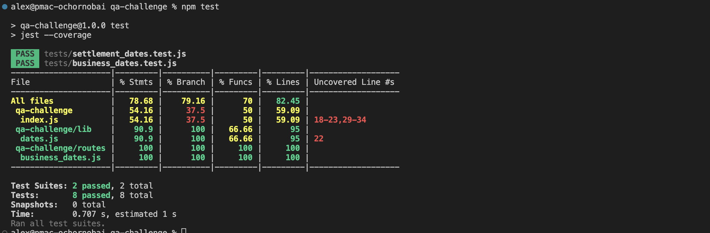

# Business Day Checker
Returns the number of business days it will take for a payment to be allocated into an account.

## Unit API Tests (challenge 1)

1. Go to `./src` directory.
3. Run `npm install`.
3. Run tests with `npm test`. 

Test `should respond with "ok: false" and error message when "delay" param is not set` should fail because of defect in app's code - status code 500 is returned and the error is not handled.

### Test Coverage

##  API Tests (challenge 2)

1. Go to `./api` directory.
2. Run `npm install`.
3. Run tests with `npm test`.